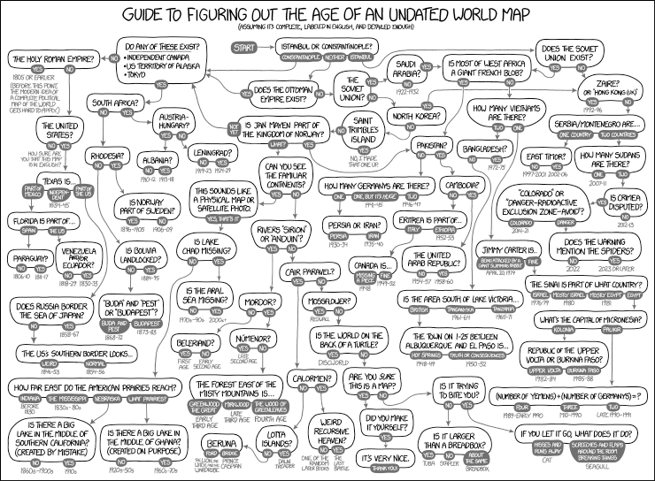

# wp2-GISLOD
Exchange for issues and code related to transposition of gemeentegeschiedenis.nl-data to LOD.

Data created during the 'Knutseldag' March 1st, 2017: are available from: http://hdl.handle.net/10622/Y00UJQ

In the grand scheme of things, we'll eventually get a Dutch map age guide, similar to the [XKCD Map Guide](https://xkcd.com/1688/).
